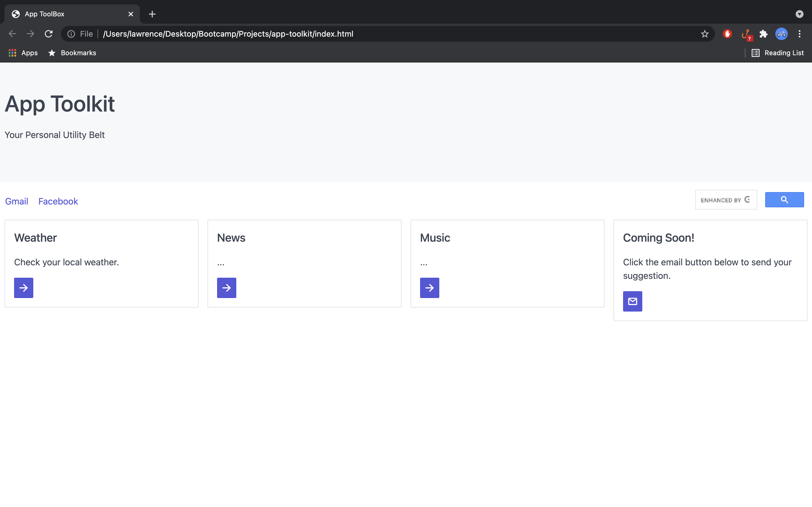

# App Toolkit

## Description
This is an application for a personal dashboard/homepage.  It is collection of tools utilizing various APIs for finding out information like weather, music, news, etc.  

It uses Spectre CSS for sytling.

It utilizes the following APIs with plenty of room to grow:
https://api.openweathermap.org/ for the weather.
https://api.nytimes.com for the news.
https://ws.audioscrobbler.com for music.

## Usage
### Weather
Click on the weather card and a modal pops up.
Enter your location and click search.
The modal refreshes with the current weather and a 5-day forecast.
Click outside the modal to return to the page.

### News
Click on the news card and a modal pops up.
The modal will display the top articles from NYT.

### Music
Click on the music card and a modal pops up.
Enter the artist name and click submit.
The modal will display the top 10 tracks for the artist.

### Coming Soon
This card is a placeholder for future apps.
Click on the mail button will open the user's default email app.

## Snapshots
